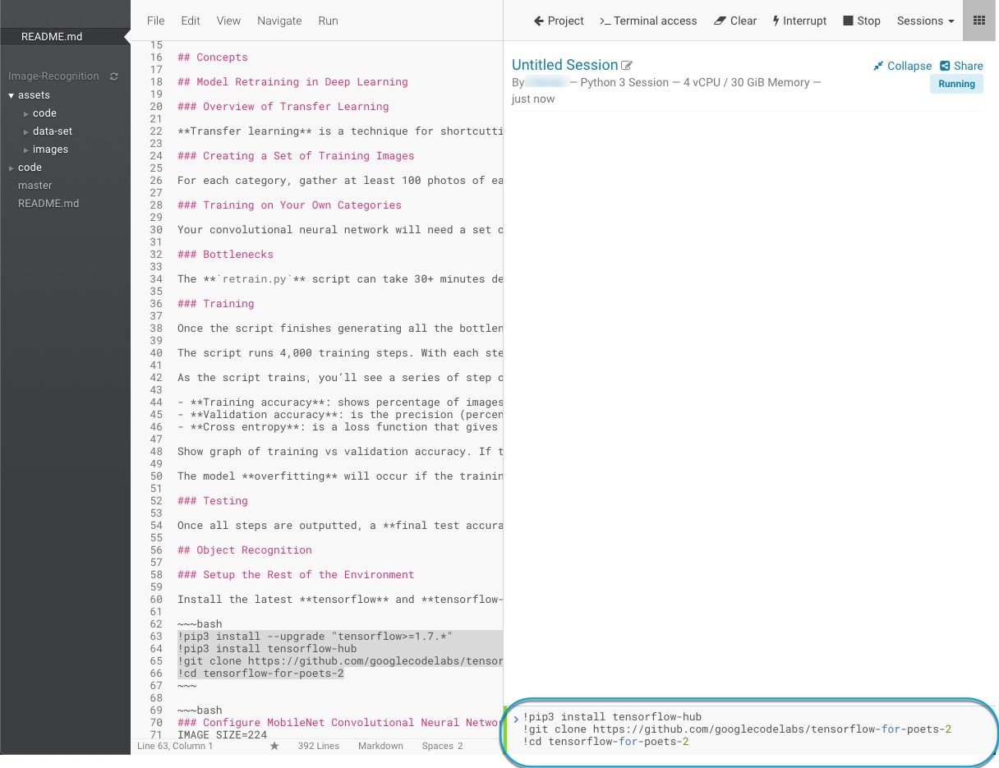
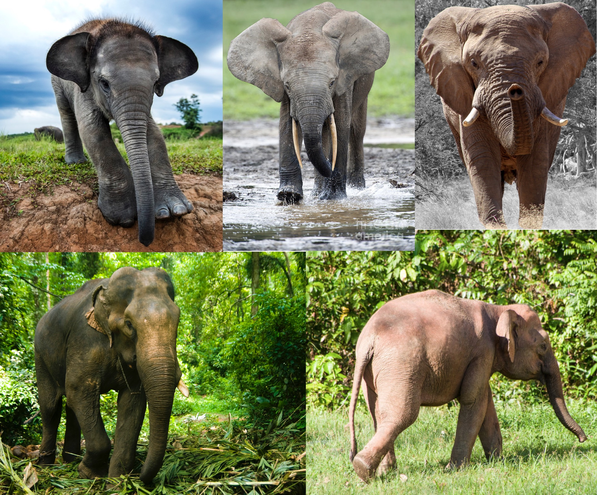
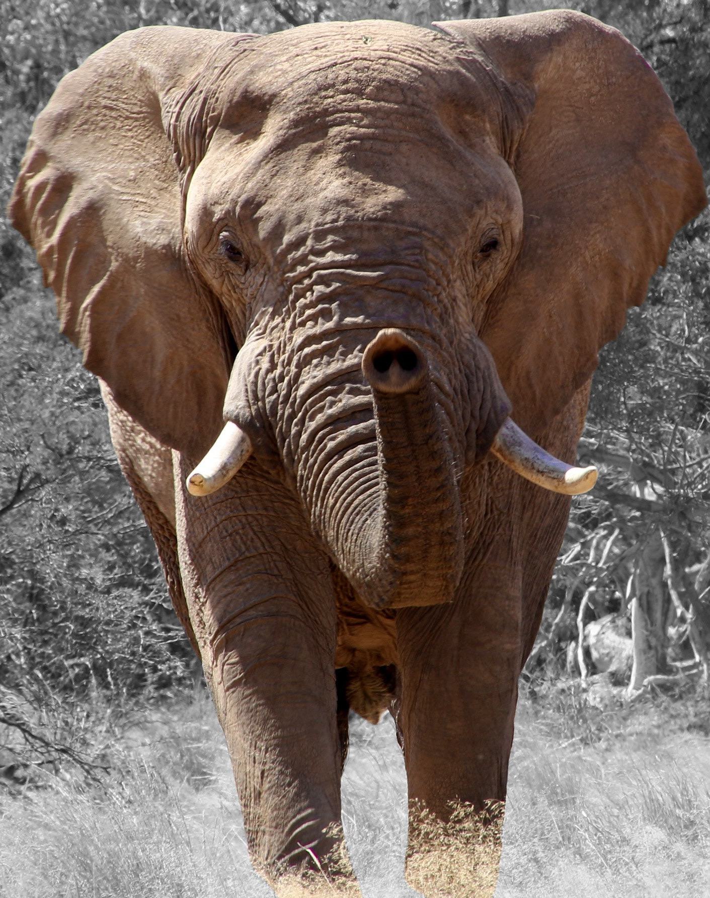
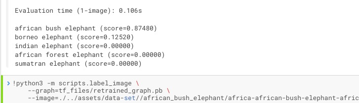
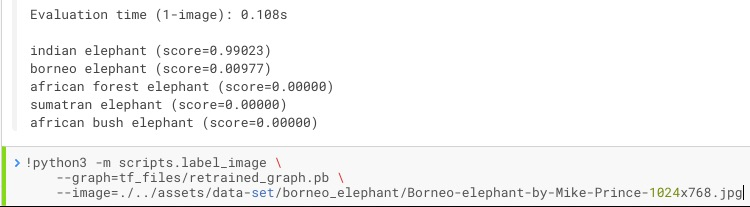
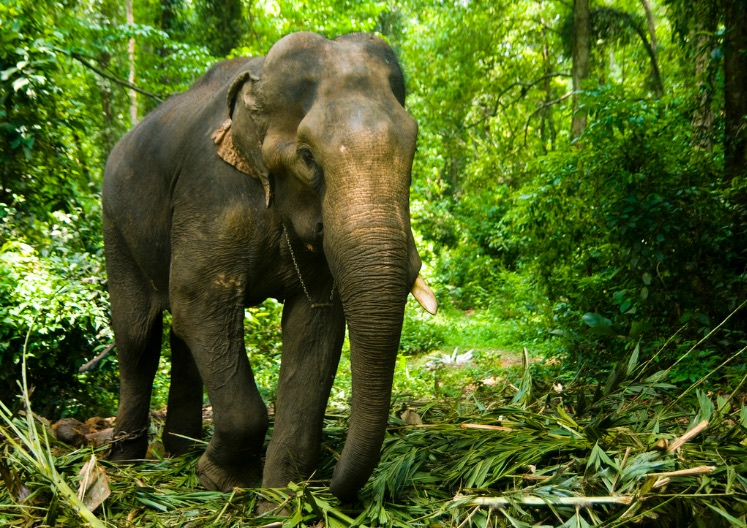
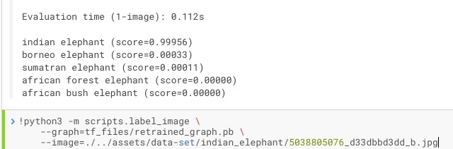
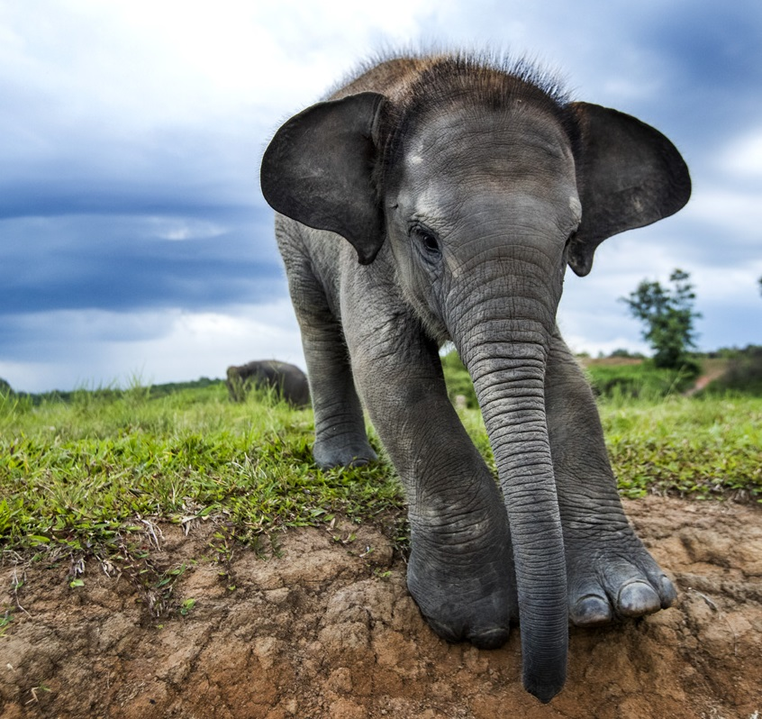
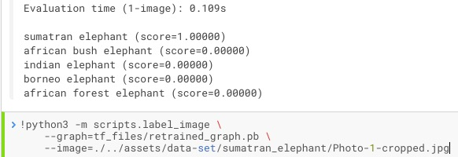

# Retraining Models for Object Recognition

## Introduction

This simple tutorial showcases model transfer learning executed on CDSW. You will learn to retrain a model to perform object recognition on elephant species that appear in images. You will provide your model with a random elephant species and see how well it performs predicting the percentage that it thinks the image is a particular elephant species.

## Outline

- [Concepts](#concepts)
- [Retrain the Model for Object Recognition](#model-retraining-in-deep-learning)
- [Test the Retrained Model on Classifying Elephants](#test-the-retrained-model-on-classifying-elephants)
- [Summary](#summary)
- [Further Reading](#further-reading)
- Appendix: Classify Flower in Image

## Concepts

## Model Retraining in Deep Learning

### Overview of Transfer Learning

**Transfer learning** is a technique for shortcutting having to tune the millions of parameters from modern image recognition models, a lot of labeled training data and computing power (hundreds of GPU hours). The process involves using a pre-trained image classifier and training a new classification layer for the final layer of that model.

### Creating a Set of Training Images

For each category, gather at least 100 photos of each object you want to recognize, but the more you gather the better the accuracy of your model. Then try to gather pictures in as wide a variety of situations, at different times with different devices to avoid the learning process picking up on anything the labeled images have in common. Split the big categories covering a lot of different physical forms into smaller ones that are more visually distinct. Check to make sure your images are labeled correctly

### Training on Your Own Categories

Your convolutional neural network will need a set of images, so you can teach it a new category you want it to recognize, such as flower species, elephant species, etc. Point the script provided in this tutorial to a folder of a category i.e. if you wish to classify cats vs. dogs separate examples of cats in one folder and dogs on a separate folder. The script loads a pre-trained module and trains a new classifier for the final layer using your new category. Even though your new category was probably not in the original **ImageNet** database of images used to train the network, transfer learning allows the lower layers of the network to be reused for your specific recognition tasks.

### Bottlenecks

The **`retrain.py`** script can take 30+ minutes depending on speed of your machine. There are two phases: phase one analyzes all images on disk and calculates and caches the bottleneck values for each image. Bottleneck is a tensorflow term known as the layer just before the final output layer, which does the classification. This penultimate layer has been trained to output a set of values good enough for the classifier to distinguish between all image categories it’s been asked to recognize. The second phase includes retraining our final layer on new categories because the kind of information needed to distinguish the ImageNet categories is also useful for distinguishing new categories. By caching the bottleneck values, if the script is rerun, they’ll be reused, so you won’t have to wait on the significant amount time it takes to recalculate them.

### Training

Once the script finishes generating all the bottleneck files, the actual training of the final layer of the network begins.

The script runs 4,000 training steps. With each step, 10 images at random are chosen from the training set, their bottlenecks are found from cache and they are fed into the final layer to get predictions. Those predictions are compared against the actual labels, and the results of this comparison is used to update the final layer’s weights through a backpropagation process.

As the script trains, you’ll see a series of step outputs, each showing training accuracy, validation accuracy and cross entropy:

- **Training accuracy**: shows percentage of images used in current training batch labeled with correct class
- **Validation accuracy**: is the precision (percentage of correctly-labelled images) on randomly-selected group of images from a different set
- **Cross entropy**: is a loss function that gives a glimpse into how well the learning process is progressing (lower numbers are better).

Show graph of training vs validation accuracy. If the training accuracy orange continues to increase while the validation accuracy decreases, the model is **overfitting**.

The model **overfitting** will occur if the training accuracy continues to increase while the validation accuracy decreases.

### Testing

Once all steps are outputted, a **final test accuracy evaluation** will be printed showing an estimate of how the trained model will perform the classification task. You will see a percentage for the model’s prediction accuracy based on the images in the test that are given the correct label after the model is fully trained.

## Object Recognition

### Setup the Rest of the Environment

First open the workbench and start a new **Python3** session

Install the latest **tensorflow** and **tensorflow-hub** then clone the Tensorflow for poets repository:

~~~bash
!pip3 install --upgrade "tensorflow==1.7.*"
!pip3 install tensorflow-hub
!git clone https://github.com/googlecodelabs/tensorflow-for-poets-2
!cd tensorflow-for-poets-2
~~~

## Retrain the Model for Object Recognition

### Train the Final Layer of MobileNet Model

Train the final layer of MobileNet model to classify elephant
species: **African Bush Elephant, African Forest Elephant, Borneo Elephant,
Indian Elephant and Sumatran Elephant**.

**Figure 1: TL - Sumatran Elephant, TM - African Forest Elephant, TR - African Bush Elephant, BL - Indian Elephant, BR - Borneo Elephant**

Run the following command to train the model using the **elephant_photos**
directory:

~~~bash
!python3 -m scripts.retrain \
  --bottleneck_dir=tf_files/bottlenecks \
  --model_dir=tf_files/models/mobilenet_0.50_224 \
  --summaries_dir=tf_files/training_summaries/mobilenet_0.50_224 \
  --output_graph=tf_files/retrained_graph.pb \
  --output_labels=tf_files/retrained_labels.txt \
  --architecture=mobilenet_0.50_224 \
  --image_dir=./../assets/data-set/
~~~

Output after training the final layer:

~~~bash
INFO:tensorflow:2018-12-14 23:46:24.931567: Step 0: Train accuracy = 44.0%
INFO:tensorflow:2018-12-14 23:46:24.931942: Step 0: Cross entropy = 2.674228
INFO:tensorflow:2018-12-14 23:46:25.078991: Step 0: Validation accuracy = 39.0% (N=100)
INFO:tensorflow:2018-12-14 23:46:25.369460: Step 10: Train accuracy = 32.0%
INFO:tensorflow:2018-12-14 23:46:25.369694: Step 10: Cross entropy = 12.489035
INFO:tensorflow:2018-12-14 23:46:25.398569: Step 10: Validation accuracy = 26.0% (N=100)

...

INFO:tensorflow:2018-12-14 23:46:41.003115: Step 499: Train accuracy = 67.0%
INFO:tensorflow:2018-12-14 23:46:41.003340: Step 499: Cross entropy = 1.781375
INFO:tensorflow:2018-12-14 23:46:41.030192: Step 499: Validation accuracy = 36.0% (N=100)
INFO:tensorflow:Final test accuracy = 46.7% (N=135)
INFO:tensorflow:Froze 2 variables.
INFO:tensorflow:Converted 2 variables to const ops.
~~~

We can see the Final test accuracy, which is the model's prediction accuracy on images of random elephant species is 46.7%.

### Test the Retrained Model on Classifying Elephants

Since we retrained our MobileNet model on elephant species, let's have some fun and see how well it performs predicting the elephant image we pass to it.

### Classify African Bush Elephant in Image

The image we are going to pass to the model is an **African Bush Elephant**:

Let's see how well the model predicts the species of the above elephant:

~~~bash
!python3 -m scripts.label_image \
	--graph=tf_files/retrained_graph.pb \
	--image=./../assets/data-set//african_bush_elephant/africa-african-bush-elephant-african-elephant-71309.jpg
~~~

Output example:

We can see the model thinks there is a 69.3% possibility that the image is of an **African Bush Elephant**.

### Classify African Forest Elephant in Image

The image we are going to pass to the model is an **African Forest Elephant**:

Let's see how well the model predicts the species of the above elephant:

~~~bash
!python3 -m scripts.label_image \
	--graph=tf_files/retrained_graph.pb \
	--image=./../assets/data-set/african_forest_elephant/7-african-forest-elephant-tony-camacho.jpg
~~~

<!-- For clarity, I changed the name of 7-african-forest-elephant-tony-camacho.jpg to african-forest-elephant.jpg -->

Output example:

We can see the model thinks there is a 100% possibility that the image is of an **African Forest Elephant**.

### Classify Borneo Elephant in Image

The image we are going to pass to the model is an **Borneo Elephant**:

Let's see how well the model predicts the species of the above elephant:

~~~bash
!python3 -m scripts.label_image \
	--graph=tf_files/retrained_graph.pb \
	--image=./../assets/data-set/borneo_elephant/Borneo-elephant-by-Mike-Prince-1024x768.jpg
~~~

Output example:

We can see the model thinks there is a 94.4% possibility that the image is of an **Sumatran Elephant**, but the model predicted wrong because the picture is of an **Borneo Elephant**.

### Classify Indian Elephant in Image

The image we are going to pass to the model is an **Indian Elephant**:

Let's see how well the model predicts the species of the above elephant:

~~~bash
!python3 -m scripts.label_image \
	--graph=tf_files/retrained_graph.pb \
	--image=./../assets/data-set/indian_elephant/5038805076_d33dbbd3dd_b.jpg
~~~

<!-- For clarity, I changed the name of 5038805076_d33dbbd3dd_b.jpg to indian-elephant.jpg -->

Output example:

We can see the model thinks there is a 99.9% possibility that the image is of an **Sumatran Elephant**, but the model predicted wrong because the picture is of an **Indian Elephant**.

### Classify Sumatran Elephant in Image

The image we are going to pass to the model is an **Sumatran Elephant**:

Let's see how well the model predicts the species of the above elephant:

~~~bash
!python3 -m scripts.label_image \
	--graph=tf_files/retrained_graph.pb \
	--image=./../assets/data-set/sumatran_elephant/Photo-1-cropped.jpg
~~~

Output example:

We can see the model thinks there is a 99.9% possibility that the image is of an **Sumatran Elephant**.

## Summary

Congratulations! You now know how to deploy tensorflow, retrain a MobileNet model for object recognition using a image dataset of elephant species. We saw there were accurate predictions by the model, but also some mispredictions. One way we can help the model perform better is to clean the dataset. Perhaps there may be outliers in the dataset that can be removed. Give it a try and see if you can improve the model's prediction accuracy.

## Further Reading

- [How to Retrain an Image Classifier for New Categories](https://www.tensorflow.org/hub/tutorials/image_retraining)
- [TensorFlow For Poets](https://codelabs.developers.google.com/codelabs/tensorflow-for-poets/#0)