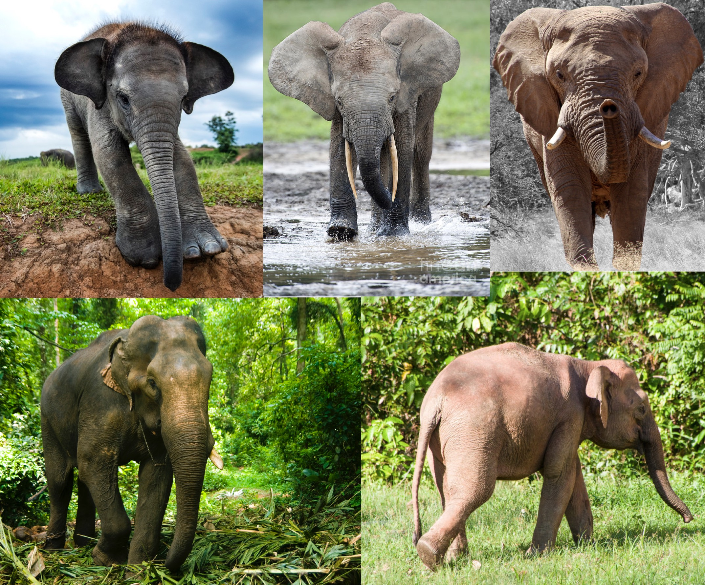
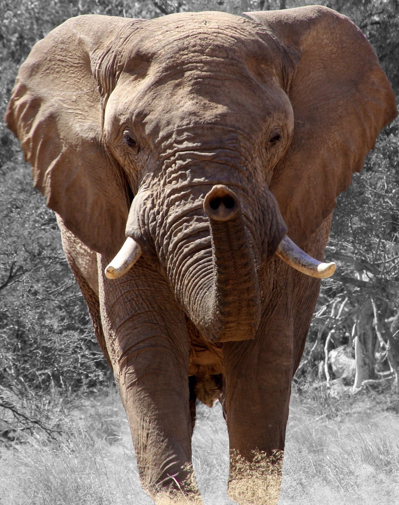
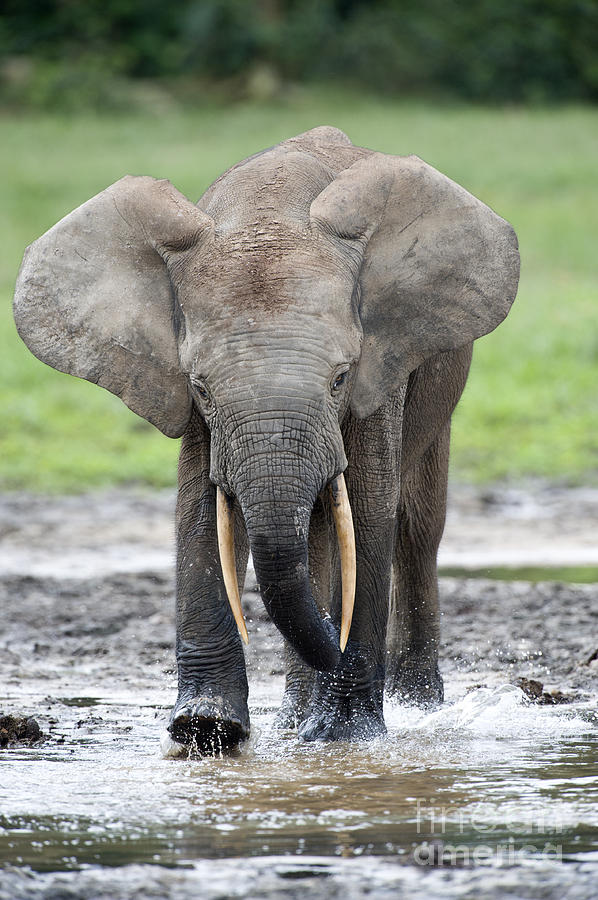
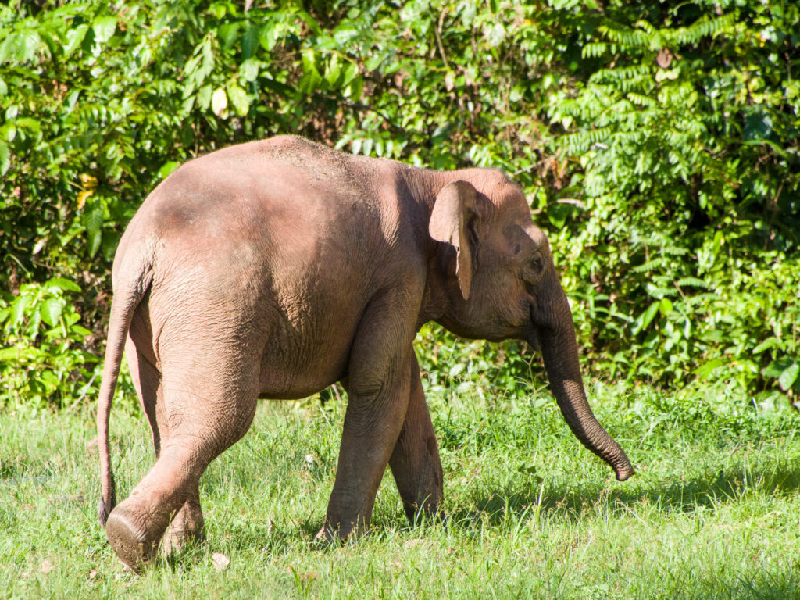
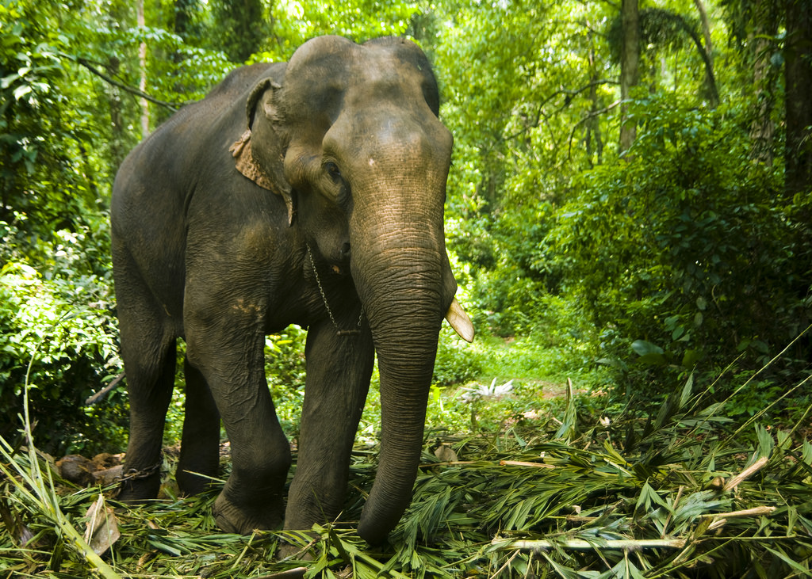

# Retraining Models for Object Recognition

## Introduction

You will setup the development environment with TensorFlow. You will learn to retrain a model to perform object recognition on elephant species that appear in images. You will provide your model with a random elephant species and see how well it performs predicting the percentage that it thinks the image is a particular elephant species.

- Ability to use Python and Tensorflow to retrain an image classifier
- Ability to classify images with your trained classifier

## Prerequisites

- Basic understanding of Linux commands
- Installed Docker on your local host machine
- Installed Virtual Machine Software

## Outline

- Concepts
- Setup Development Environment
- Retrain the Model for Object Recognition
- Test the Retrained Model on Classifying Elephants
- Summary
- Further Reading
- Appendix: Classify Flower in Image

## Concepts

## Model Retraining in Deep Learning

### Bottlenecks

ImageNet doesn’t include flower species we’re training on here. The kinds of info that make it possible for ImageNet to differentiate among 1000 classes are useful for distinguishing other objects. By using this pre-trained network, we are using that information as input to final or last classification layer that distinguishes our flower classes.

Bottleneck is a term in deep learning that signifies the layer prior to the final layer that does the classification. Calculating the layers behind the bottleneck for each image takes a significant amount of time. Since these lower layers of the network aren’t being modified their outputs can be cached and reused. So, the script runs the constant part of the network, everything below the node labeled Bottleneck above and caching the results.

### Training

Once the script finishes generating all the bottleneck files, the actual training of the final layer of the network begins.

The script runs 4,000 training steps. With each step, 10 images at random are chosen from the training set, their bottlenecks are found from cache and they are fed into the final layer to get predictions. Those predictions are compared against the actual labels, and the results of this comparison is used to update the final layer’s weights through a backpropagation process.

As the script trains, you’ll see a series of step outputs, each showing training accuracy, validation accuracy and cross entropy:

- **Training accuracy**: shows percentage of images used in current training batch labeled with correct class
- **Validation accuracy**: is the precision (percentage of correctly-labelled images) on randomly-selected group of images from a different set
- **Cross entropy**: is a loss function that gives a glimpse into how well the learning process is progressing (lower numbers are better).

Show graph of training vs validation accuracy. If the training accuracy orange continues to increase while the validation accuracy decreases, the model is **overfitting**.

The model **overfitting** will occur if the training accuracy continues to increase while the validation accuracy decreases. **Tensorboard** is a graphing software that shows a visual of the training vs validation as the model is being retrained.

## MobileNet

## Object Recognition

## Setup Development Environment

### Option 1: Install TensorFlow Docker Container

Open your terminal, linux shell or windows ubuntu shell. Run the command to download the docker **tensorflow** image:

~~~bash
cd ~/Downloads
# Clone the tensorflow repo
git clone https://github.com/james94/tensorflow.git
cd ~/Downloads/tensorflow/tensorflow/tools/dockerfiles
# Build a tensorflow docker image
docker build -f dockerfiles/cpu.Dockerfile -t tensorflow .
# Deploy Docker Container Mounted to Elephant Images on Host Machine
docker run -p 8888:8888 -p 6006:6006 -it -v ~/Desktop/elephant_photos:/tmp/tf_files/elephant_photos tensorflow bash
~~~

> Note: the volume mount to your elephant photos may be at a different location than
`~/Desktop/elephant_photos:`, so make sure to specify the path to your images.
Docker will create the directory path `/tmp/tf_files/elephant_photos` to connect
your photos between `host-dir:docker-container-dir`.

Jump to **Clone TensorFlow for Poets Application** section.

### Option 2: Install TensorFlow in Virtual Machine

On a virtual machine running linux, run the command to install the latest **tensorflow**:

~~~bash
pip install--upgrade "tensorflow>=1.7.*"
pip install tensorflow-hub
~~~

### Setup the Rest of the Environment

~~~bash
# Clone TensorFlow for Poets Application
git clone https://github.com/googlecodelabs/tensorflow-for-poets-2
cd tensorflow-for-poets-2
# Download the Training Images
curl -LO http://download.tensorflow.org/example_images/flower_photos.tgz
# Extract flower photos to tf_files dir
tar -xf flower_photos.tgz -C tf_files
ls tf_files/flower_photos
### Configure MobileNet Convolutional Neural Network
IMAGE_SIZE=224
ARCHITECTURE="mobilenet_0.50_${IMAGE_SIZE}"
~~~

## Retrain the Model for Object Recognition

### Train the Final Layer of MobileNet Model

Train the final layer of MobileNet model to classify elephant
species: **African Bush Elephant, African Forest Elephant, Borneo Elephant,
Indian Elephant and Sumatran Elephant**.

**Figure 1: TL - Sumatran Elephant, TM - African Forest Elephant, TR - African Bush Elephant, BL - Indian Elephant, BR - Borneo Elephant**

Run the following command to train the model using the **elephant_photos**
directory:

~~~bash
python -m scripts.retrain \
	--bottleneck_dir=tf_files/bottlenecks \
	--how_many_training_steps=500 \
	--model_dir=tf_files/models/ \
	--summaries_dir=tf_files/training_summaries/"${ARCHITECTURE}" \
	--output_graph=tf_files/retrained_graph.pb \
	--output_labels=tf_files/retrained_labels.txt \
	--architecture="${ARCHITECTURE}" \
	--image_dir=/tmp/tf_files/elephant_photos
~~~

Output after training the final layer:

~~~bash
INFO:tensorflow:2018-12-14 23:46:24.931567: Step 0: Train accuracy = 44.0%
INFO:tensorflow:2018-12-14 23:46:24.931942: Step 0: Cross entropy = 2.674228
INFO:tensorflow:2018-12-14 23:46:25.078991: Step 0: Validation accuracy = 39.0% (N=100)
INFO:tensorflow:2018-12-14 23:46:25.369460: Step 10: Train accuracy = 32.0%
INFO:tensorflow:2018-12-14 23:46:25.369694: Step 10: Cross entropy = 12.489035
INFO:tensorflow:2018-12-14 23:46:25.398569: Step 10: Validation accuracy = 26.0% (N=100)

...

INFO:tensorflow:2018-12-14 23:46:41.003115: Step 499: Train accuracy = 67.0%
INFO:tensorflow:2018-12-14 23:46:41.003340: Step 499: Cross entropy = 1.781375
INFO:tensorflow:2018-12-14 23:46:41.030192: Step 499: Validation accuracy = 36.0% (N=100)
INFO:tensorflow:Final test accuracy = 46.7% (N=135)
INFO:tensorflow:Froze 2 variables.
INFO:tensorflow:Converted 2 variables to const ops.
~~~

We can see the Final test accuracy, which is the model's prediction accuracy on images of random elephant species is 46.7%.

### Test the Retrained Model on Classifying Elephants

Since we retrained our MobileNet model on elephant species, let's have some fun and see how well it performs predicting the elephant image we pass to it.

### Classify African Bush Elephant in Image

The image we are going to pass to the model is an **African Bush Elephant**:

Let's see how well the model predicts the species of the above elephant:

~~~bash
python -m scripts.label_image \
	--graph=tf_files/retrained_graph.pb \
	--image=/tmp/tf_files/elephant_photos/african_bush_elephant/africa-african-bush-elephant-african-elephant-71309.jpg
~~~

<!-- For clarity, I changed the name of africa-african-bush-elephant-african-elephant-71309.jpg to african-bush-elephant.jpg -->

Output example:

~~~bash
2018-12-20 17:11:20.397323: I tensorflow/core/platform/cpu_feature_guard.cc:141] Your CPU supports instructions that this TensorFlow binary was not compiled to use: AVX2 FMA
2018-12-20 17:11:20.459256: W tensorflow/core/framework/allocator.cc:122] Allocation of 65233920 exceeds 10% of system memory.

Evaluation time (1-image): 0.128s

african bush elephant (score=0.69358)
borneo elephant (score=0.30448)
indian elephant (score=0.00185)
sumatran elephant (score=0.00006)
african forest elephant (score=0.00004)
~~~

We can see the model thinks there is a 69.3% possibility that the image is of an **African Bush Elephant**.

### Classify African Forest Elephant in Image

The image we are going to pass to the model is an **African Forest Elephant**:

Let's see how well the model predicts the species of the above elephant:

~~~bash
python -m scripts.label_image \
	--graph=tf_files/retrained_graph.pb \
	--image=/tmp/tf_files/elephant_photos/african_forest_elephant/7-african-forest-elephant-tony-camacho.jpg
~~~

<!-- For clarity, I changed the name of 7-african-forest-elephant-tony-camacho.jpg to african-forest-elephant.jpg -->

Output example:

~~~bash
2018-12-20 17:08:08.144847: I tensorflow/core/platform/cpu_feature_guard.cc:141] Your CPU supports instructions that this TensorFlow binary was not compiled to use: AVX2 FMA

Evaluation time (1-image): 0.128s

african forest elephant (score=1.00000)
sumatran elephant (score=0.00000)
borneo elephant (score=0.00000)
indian elephant (score=0.00000)
african bush elephant (score=0.00000)
~~~

We can see the model thinks there is a 100% possibility that the image is of an **African Forest Elephant**.

### Classify Borneo Elephant in Image

The image we are going to pass to the model is an **Borneo Elephant**:

Let's see how well the model predicts the species of the above elephant:

~~~bash
python -m scripts.label_image \
	--graph=tf_files/retrained_graph.pb \
	--image=/tmp/tf_files/elephant_photos/borneo_elephant/Borneo-elephant-by-Mike-Prince-1024x768.jpg
~~~

<!-- For clarity, I changed the name of Borneo-elephant-by-Mike-Prince-1024x768.jpg to borneo-elephant.jpg -->

Output example:

~~~bash
2018-12-20 17:03:04.737146: I tensorflow/core/platform/cpu_feature_guard.cc:141] Your CPU supports instructions that this TensorFlow binary was not compiled to use: AVX2 FMA

Evaluation time (1-image): 0.130s

sumatran elephant (score=0.94462)
borneo elephant (score=0.03253)
african forest elephant (score=0.02083)
indian elephant (score=0.00202)
african bush elephant (score=0.00000)
~~~

We can see the model thinks there is a 94.4% possibility that the image is of an **Sumatran Elephant**, but the model predicted wrong because the picture is of an **Borneo Elephant**.

### Classify Indian Elephant in Image

The image we are going to pass to the model is an **Indian Elephant**:

Let's see how well the model predicts the species of the above elephant:

~~~bash
python -m scripts.label_image \
	--graph=tf_files/retrained_graph.pb \
	--image=/tmp/tf_files/elephant_photos/indian_elephant/5038805076_d33dbbd3dd_b.jpg
~~~

<!-- For clarity, I changed the name of 5038805076_d33dbbd3dd_b.jpg to indian-elephant.jpg -->

Output example:

~~~bash
2018-12-20 16:54:23.657256: I tensorflow/core/platform/cpu_feature_guard.cc:141] Your CPU supports instructions that this TensorFlow binary was not compiled to use: AVX2 FMA

Evaluation time (1-image): 0.136s

sumatran elephant (score=0.99997)
indian elephant (score=0.00002)
borneo elephant (score=0.00001)
african forest elephant (score=0.00000)
african bush elephant (score=0.00000)
~~~

We can see the model thinks there is a 99.9% possibility that the image is of an **Sumatran Elephant**, but the model predicted wrong because the picture is of an **Indian Elephant**.

### Classify Sumatran Elephant in Image

The image we are going to pass to the model is an **Sumatran Elephant**:

Let's see how well the model predicts the species of the above elephant:

~~~bash
python -m scripts.label_image \
	--graph=tf_files/retrained_graph.pb \
	--image=/tmp/tf_files/elephant_photos/sumatran_elephant/Photo-1-cropped.jpg
~~~

<!-- For clarity, I changed the name of Photo-1-cropped.jpg to sumatran-elephant.jpg -->

Output example:

~~~bash
2018-12-20 16:48:35.487994: I tensorflow/core/platform/cpu_feature_guard.cc:141] Your CPU supports instructions that this TensorFlow binary was not compiled to use: AVX2 FMA

Evaluation time (1-image): 0.129s

sumatran elephant (score=0.99998)
african forest elephant (score=0.00001)
african bush elephant (score=0.00000)
indian elephant (score=0.00000)
borneo elephant (score=0.00000)
~~~

We can see the model thinks there is a 99.9% possibility that the image is of an **Sumatran Elephant**.

## Summary

Congratulations! You now know how to deploy tensorflow, retrain a MobileNet model for object recognition using a image dataset of elephant species. We saw there were accurate predictions by the model, but also some mispredictions. One way we can help the model perform better is to clean the dataset. Perhaps there may be outliers in the dataset that can be removed. Give it a try and see if you can improve the model's prediction accuracy.

## Further Reading

- [How to Retrain an Image Classifier for New Categories](https://www.tensorflow.org/hub/tutorials/image_retraining)
- [TensorFlow For Poets](https://codelabs.developers.google.com/codelabs/tensorflow-for-poets/#0)

## Appendix: Classify Flower in Image

### Train Final Layer with Flower Photos

Train the final layer of ImageNet model using flower_photos.

~~~bash
python -m scripts.retrain \
	--bottleneck_dir=tf_files/bottlenecks \
	--how_many_training_steps=500 \
	--model_dir=tf_files/models/ \
	--summaries_dir=tf_files/training_summaries/"${ARCHITECTURE}" \
	--output_graph=tf_files/retrained_graph.pb \
	--output_labels=tf_files/retrained_labels.txt \
	--architecture="${ARCHITECTURE}" \
	--image_dir=tf_files/flower_photos
~~~

Output after training the final layer:

~~~bash
INFO:tensorflow:2018-12-15 00:18:09.412453: Step 0: Train accuracy = 68.0%
INFO:tensorflow:2018-12-15 00:18:09.412679: Step 0: Cross entropy = 0.880066
INFO:tensorflow:2018-12-15 00:18:09.570666: Step 0: Validation accuracy = 61.0% (N=100)
INFO:tensorflow:2018-12-15 00:18:09.856491: Step 10: Train accuracy = 69.0%
INFO:tensorflow:2018-12-15 00:18:09.856694: Step 10: Cross entropy = 1.098178
INFO:tensorflow:2018-12-15 00:18:09.884023: Step 10: Validation accuracy = 64.0% (N=100)

...

INFO:tensorflow:2018-12-15 00:18:25.294948: Step 499: Train accuracy = 96.0%
INFO:tensorflow:2018-12-15 00:18:25.295227: Step 499: Cross entropy = 0.130251
INFO:tensorflow:2018-12-15 00:18:25.322254: Step 499: Validation accuracy = 88.0% (N=100)
INFO:tensorflow:Final test accuracy = 91.4% (N=362)
INFO:tensorflow:Froze 2 variables.
INFO:tensorflow:Converted 2 variables to const ops.
~~~

We can see the Final test accuracy, which is the model's prediction accuracy on images of random flowers is 91.4%.

### Classify Daisy in Image

The image we are going to pass to the model is a **daisy**.

Let's see how well the model predicts the flower type:

~~~bash
python  -m scripts.label_image \
	--graph=tf_files/retrained_graph.pb \
	--image=tf_files/flower_photos/daisy/21652746_cc379e0eea_m.jpg
~~~

Output example:

~~~bash
2018-12-20 17:18:36.164373: I tensorflow/core/platform/cpu_feature_guard.cc:141] Your CPU supports instructions that this TensorFlow binary was not compiled to use: AVX2 FMA

Evaluation time (1-image): 0.132s

daisy (score=0.98156)
dandelion (score=0.01527)
sunflowers (score=0.00306)
roses (score=0.00011)
tulips (score=0.00000)
~~~

We can see the model thinks there is a 98.1% possibility that the image is of a **daisy**.

### Classify Rose in Image

The image we are going to pass to the model is a **rose**.

Let's see how well the model predicts the flower type:

~~~bash
python -m scripts.label_image \
	--graph=tf_files/retrained_graph.pb \
	--image=tf_files/flower_photos/roses/2414954629_3708a1a04d.jpg
~~~

Output example:

~~~bash
2018-12-20 17:19:46.838240: I tensorflow/core/platform/cpu_feature_guard.cc:141] Your CPU supports instructions that this TensorFlow binary was not compiled to use: AVX2 FMA

Evaluation time (1-image): 0.131s

roses (score=0.91378)
tulips (score=0.08614)
dandelion (score=0.00006)
sunflowers (score=0.00001)
daisy (score=0.00000)
~~~

We can see the model thinks there is a 91.3% possibility that the image is of a **daisy**.
